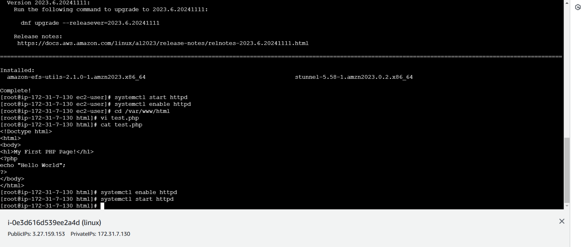
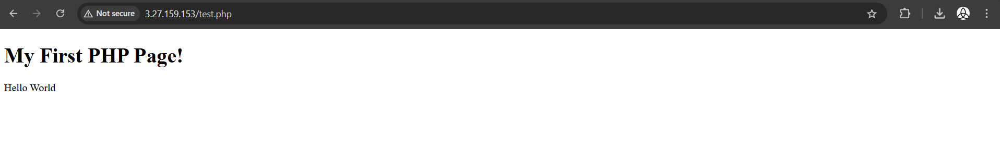

 # CREATION IN WEB APPLICATION FOR TEST ENVIRONMENT
## AIM
To Creation in Web Application for Test Environment.
## PROBLEM STATEMENT
Creating a web application for a test environment is essential to provide developers and testers with a dedicated platform to simulate, test, and validate software functionalities. The challenge lies in building an easy-to-use, scalable, and efficient application that supports realistic testing scenarios, automates workflows, and ensures smooth collaboration while minimizing setup and maintenance efforts.

## ALGORITHM
 ### Steps 1:
Launch an EC2 instance in AWS using an Amazon Linux 2 AMI with a Security Group allowing HTTP and SSH traffic.
 ### Steps 2:
Connect to the instance using SSH and install a web server like Apache
 ### Steps 3:
Create a simple HTML file in the server's default directory with basic content for testing.
 ### Steps 4:
Access the instance's public IP in a browser to verify the HTML page is displayed.

## COMMANDS
## To install httpd:
~~~
yum install httpd -y
~~~
## To enable and start httpd :
~~~
systemctl enable httpd
systemctl start httpd
~~~
## Create a simple HTML page :
~~~
cd /var/www/html
~~~

## OUTPUT

### REG NUMBER:212223220105
### NAME:SHANMUGAKARTHIK G

## RESULT
 Thus, The web application for test environment has successfully been created and executed.